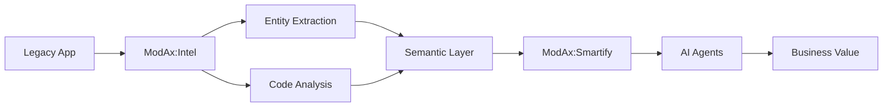

# Analyze ModAx Architecture Command

Analyze and visualize the ModAx architecture: $ARGUMENTS

## Architecture Analysis

### 1. Current State Analysis
Examine the existing codebase structure and identify:
- Module boundaries and dependencies
- Data flow patterns
- Integration points
- Technical debt areas

### 2. Intelligence Fabric Mapping
Map how ModAx modules contribute to the Intelligence Fabric:

```
Traditional App → ModAx Modules → Intelligence Layer → AI Capabilities
     ↓                ↓                   ↓                    ↓
Legacy Code    Intel+SpecGen      Semantic Data         Smart Agents
```

### 3. Module Interactions

#### Data Flow


#### Intelligence Pipeline
1. **Ingestion**: Legacy code and data sources
2. **Analysis**: ModAx:Intel extracts patterns and entities
3. **Specification**: ModAx:SpecGen creates semantic models
4. **Transformation**: ModAx:UXForge builds modern interfaces
5. **Intelligence**: ModAx:Smartify deploys AI agents
6. **Evolution**: Continuous learning and improvement

### 4. Technical Architecture

#### Frontend Architecture
- **Micro-frontends**: Each ModAx module as independent app
- **Shared Libraries**: Common components and utilities
- **State Management**: Federated with zustand
- **Communication**: Event bus for module coordination

#### Backend Architecture
- **API Gateway**: Unified entry point
- **Microservices**: Module-specific services
- **Message Queue**: Async processing
- **Data Lake**: Centralized intelligence storage

#### Infrastructure Architecture
- **Containerization**: Docker for each module
- **Orchestration**: Kubernetes/ECS
- **Serverless**: Lambda for AI agents
- **CDN**: Global distribution

### 5. Scalability Considerations

#### Horizontal Scaling
- Independent module scaling
- Load balancer configuration
- Database read replicas
- Caching strategy

#### Performance Optimization
- Code splitting by module
- Lazy loading strategies
- API response caching
- CDN optimization

### 6. Security Architecture

#### Authentication Flow
```
User → Auth0/Okta → JWT → API Gateway → Services
                      ↓
                 Permissions → RBAC → Resource Access
```

#### Data Security
- Encryption at rest (AES-256)
- TLS 1.3 for transit
- Key rotation policy
- Audit logging

### 7. Integration Patterns

#### Client Systems
- REST API endpoints
- GraphQL interface (future)
- Webhook notifications
- Real-time subscriptions

#### Third-party Services
- Cloud provider APIs
- AI/ML services
- Analytics platforms
- Monitoring tools

### 8. Deployment Architecture

#### Blue-Green Deployment
```
Load Balancer
    ├── Blue Environment (Current)
    └── Green Environment (New)
         ↓
    Health Checks → Traffic Switch
```

#### Module Deployment
- Independent deployment cycles
- Feature flags for gradual rollout
- Automated rollback triggers
- Canary deployments

### 9. Monitoring Architecture

#### Observability Stack
- **Logs**: CloudWatch Logs aggregation
- **Metrics**: Custom CloudWatch metrics
- **Traces**: X-Ray distributed tracing
- **Alerts**: SNS topic notifications

#### Key Metrics
- Module performance metrics
- AI agent effectiveness
- User engagement analytics
- System health indicators

### 10. Future Architecture Evolution

#### Phase 1: Current State
- Monolithic frontend
- Module-based organization
- Basic AI integration

#### Phase 2: Microservices
- Micro-frontend architecture
- Service mesh (Istio)
- Advanced orchestration

#### Phase 3: AI-Native Platform
- Autonomous agents
- Self-healing systems
- Predictive scaling
- Neural architecture search

## Recommendations

### Short-term (1-3 months)
1. Implement module isolation
2. Set up CI/CD pipelines
3. Add comprehensive monitoring
4. Create API documentation

### Medium-term (3-6 months)
1. Migrate to microservices
2. Implement service mesh
3. Add GraphQL layer
4. Enhance security posture

### Long-term (6-12 months)
1. Full AI-native transformation
2. Multi-region deployment
3. Advanced ML pipelines
4. Partner integrations

## Generate Architecture Artifacts

1. **C4 Diagrams**
   - Context diagram
   - Container diagram
   - Component diagram
   - Code diagram

2. **Documentation**
   - Architecture Decision Records (ADRs)
   - API specifications
   - Deployment guides
   - Security documentation

3. **Code Analysis**
   - Dependency graphs
   - Complexity metrics
   - Coverage reports
   - Performance profiles

Usage: `/analyze-architecture [--visualize] [--report] [--recommendations]`